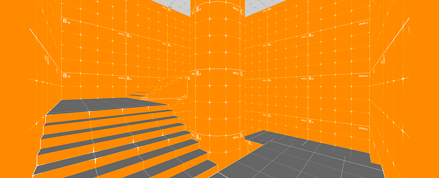
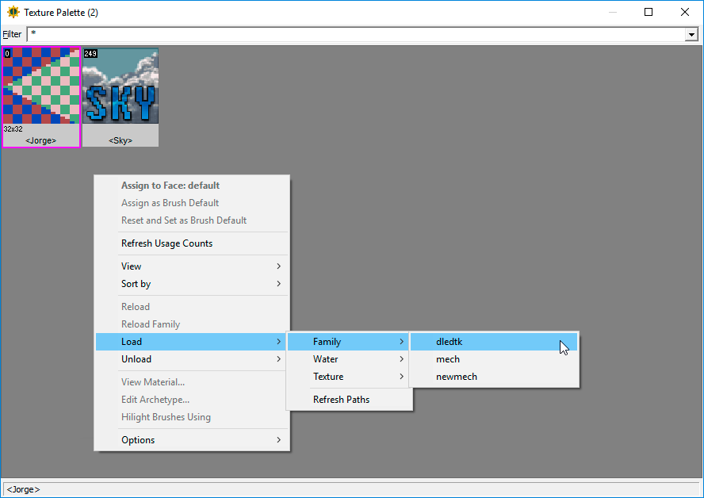
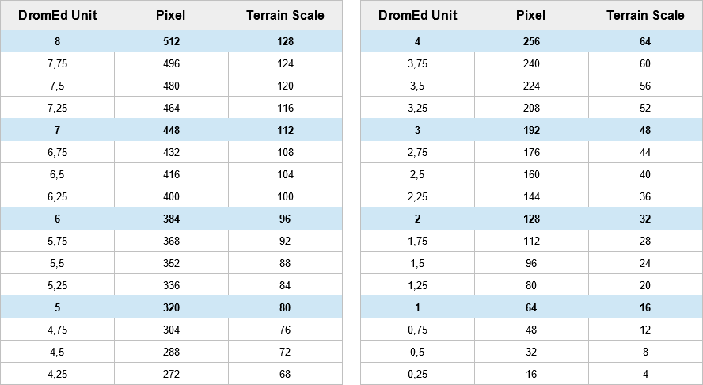

# DromEd Level Editor Developer Textures Kit

**DromEd Level Editor Developer Textures Kit** is a free, open source project for the [Dark Engine's level editor called DromEd](https://en.wikipedia.org/wiki/Dark_Engine#DromEd) (ShockEd for System Shock 2 video game). It's basically a simple set of textures that makes easier to build fan missions.



> **Current version**: 1.2.3 (2025.11.23) - [[Original Project Page](https://github.com/jonathanlinat/dledtk)] [[TTLG thread](http://www.ttlg.com/forums/showthread.php?t=147675&p=2351521&viewfull=1#post2351521)]

**Changes from original project by Jonathan Linat**

The original project has sadly not received any updates in 8 years, leaving two issues present in the pack. These problems are now fixed in this fork.
- Removed 'dledtk' prefix from files to reduce file string length.
- Adjusted .mtl definition files to always display correctly when lighting is baked.

This set has now **222 textures** (+58): 1x1, 1x2, 1x4, 1x8; 2x1, 2x2, 2x4, 2x8; 4x1, 4x2, 4x4, 4x8; 8x1, 8x2, 8x4, 8x8 + Material Design colored ones + 4 special ones.

## Install

Download this repo as a .zip by clicking the 'Code' button above.

## Usage

Best practice is to create a dedicated mod folder for editor textures (unless you deliberately want to use these textures).
- Create a new folder called 'EditorMod', and another folder called 'dledtk'.
- Inside the 'dledtk' folder, extract the 'fam' folder from the .zip of the repo
- In your Thief 1/2 root folder, either copy or symlink/junction your new 'EditorMod' folder to your install.
- In your 'cam_mod.ini' file, modify the 'mod_path' line to look something like this:
```
; these are normal mod paths which are applied after the active FM in the search order
mod_path .\EditorMods\dledtk
```
- And you're done! You can now load the texture family when inside DromEd.



## Contributing

You can create new textures using the PSD files (CS6) located into the `src/` folder. Use this guide to know the right texture sizes:



## Licence

MIT License

Copyright (c) 2017 Jonathan Linat

Permission is hereby granted, free of charge, to any person obtaining a copy of this software and associated documentation files (the "Software"), to deal in the Software without restriction, including without limitation the rights to use, copy, modify, merge, publish, distribute, sublicense, and/or sell copies of the Software, and to permit persons to whom the Software is furnished to do so, subject to the following conditions:

The above copyright notice and this permission notice shall be included in all copies or substantial portions of the Software.

THE SOFTWARE IS PROVIDED "AS IS", WITHOUT WARRANTY OF ANY KIND, EXPRESS OR IMPLIED, INCLUDING BUT NOT LIMITED TO THE WARRANTIES OF MERCHANTABILITY, FITNESS FOR A PARTICULAR PURPOSE AND NONINFRINGEMENT. IN NO EVENT SHALL THE AUTHORS OR COPYRIGHT HOLDERS BE LIABLE FOR ANY CLAIM, DAMAGES OR OTHER LIABILITY, WHETHER IN AN ACTION OF CONTRACT, TORT OR OTHERWISE, ARISING FROM, OUT OF OR IN CONNECTION WITH THE SOFTWARE OR THE USE OR OTHER DEALINGS IN THE SOFTWARE.
